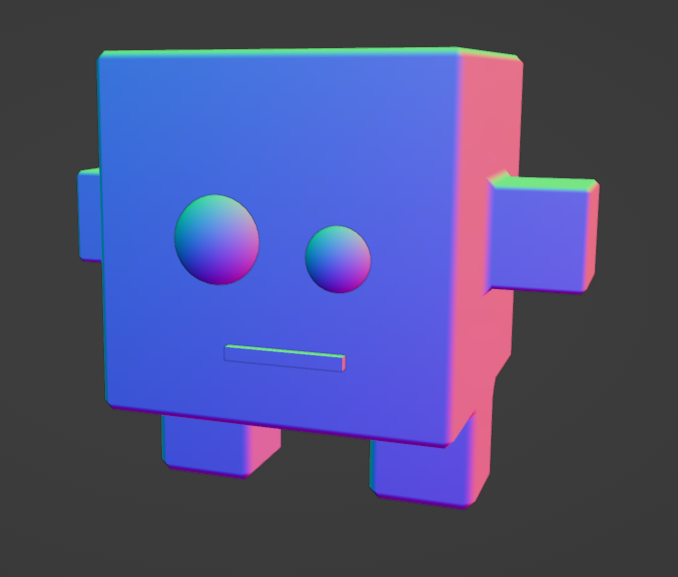

# Voxeling
The **voxeling** entity is the primary context for voxel building games. Voxelings primarily inhabit the [Voxel Village]() attraction. They can move freely, jump in 3D space, wall jump, wall slide, spawn and subtract voxels, before coming to rest on a grid space.

_(Scale: With their arms out stretched, voxelings can reach about 0.1 m across.)_

### Absorbing Colors
Voxelings absorb color from the lights in the level. Stand under a light and the voxeling's hue will shift towards that color. The voxeling loses its color as it creates blocks.

## Player Controls
The voxeling controls should closely mirror the standard Kirkja 3rd person control scheme.

### Voxeling Movement
| Action | Keyboard / Mouse | Gamepad | Description |
| - | :-: | :-: | - |
| camera_orbit | `Mouselook` | `Rightstick` | 3rd person camera controls. |
| camera_zoom | `MMW` | | Zoom to a range between 3rd person and 1st person view. |
| move_forward | `W` | `Leftstick` push forward | The camera follows behind the character. |
| move_back | `S` | `Leftstick` pull back |  |
| move_left | `A` | `Leftstick` push left | Strafe left. |
| move_right | `D` | `Leftstick` push right | Strafe right |
| jump | `Space` | `A` | Jumps 1 block in height, allowing the voxeling to hop over voxels. |
| wall_cling | Hold `Space` | Hold `A` | Requires an adjacent wall block. When falling next to a wall, holding jump will slide the voxeling to a stop on the next block. (or one more?) When the user releases the jump button, the voxeling jumps normally before starting to fall again. |
| wall_slide | Release `Space` | Release `A` | Press toward wall. |
| grab_next_tool | `Tab` | `RB` | Grab the next tool.|
| grab_previous_tool | `Shift` + `Tab` | `LB` | Grab the previous tool. |

### Voxeling Tools
| Tool | Hotkey | `LMB` / `LT` | `RMB` / `RT` |
| - | :-: | - | - |
| Create | `1` | Spawn voxel. | Delete voxel. |
| Rotate | `2` | Rotate the targeted voxel around its Y axis. | Rotate the voxel "forward" _(over its top)_ around the X or Z axis, based on the side of the voxel the player has targeted clicking the `RMB`. |
| Shape | `3` | Next shape. | Previous shape. |
| Color | `4` | Paint voxel. | Open / close color ring palette. |

## Assets

### SFX
- [ ] foot_step
- [ ] jump
- [ ] land
- [ ] spawn_voxel
- [ ] delete_voxel

### Model
- [ ] voxeling.glb
- [x] Game Mesh
  - [x] T-pose
  - [ ] Unwrap
  - [ ] Paint and bake textures
    - [ ] Color
    - [ ] ORM
    - [ ] Normals bake
    - [ ] AO bake

### Rig
- [x] Armature
  - [x] Symmetrical bipedal rig
  - [x] Weight paint

### Animation
The voxeling will have a variety of animations that may have a different percentage of occurring during voxeling actions.

- [ ] idle
- [ ] run
- [ ] cling
- [ ] jump
  - [ ] airborn
  - [ ] falling
  - [ ] land
- [ ] walk
- [ ] spawn_voxel
- [ ] delete_voxel

### UI
The player will need a reminder of their current tool state.
- [ ] Control node dev UI.
  - [ ] Toolbar
