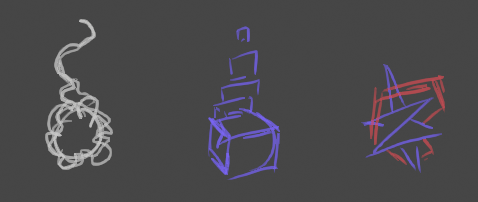

# Voidling

**Voidlings** are ephemeral entities that may intersect and pass through most in-game objects. Voidlings are largely unable to affect the world on their own. Voidlings will need to pop in and out of  without a [context](../Context)  

As a voidling, we will be able to travel around the world of Kirkja looking for [new contexts](../Context) to inhabit.

## Look & Feel
Voidlings may come in many a shape and size. Most are uniform in nature, with an average dimension of 0.3 m³. Many have trails and particle effects. Players will have many options when customizing their voidling.

## Movement
The voidling entity essentially acts as the player's 3D in-game cursor; it should feel intuitive and responsive.

Voidlings should be able to access a reasonable amount of jump space (maybe 3 times higher than a default jump?). Voidlings primarily move forward and back, left and right, but can learn skills to fly up and down, stick to walls, and twist into hidden worlds.

Voidling movement is limited by a fog-of-war, but the fog is lifted as the player travels around the world within new contexts.

## Context Habitation
Voidlings hop-in and hop-out of [contexts](../Context) to **interact with** and **affect** the in-game world. Contexts are usually NPC quest givers, but could also be animals, or inanimate objects.

## Void Space
Void Space is the persistent personal area that every voidling has access to. It includes the main menu, inventory, neighborhoods, and portals.
