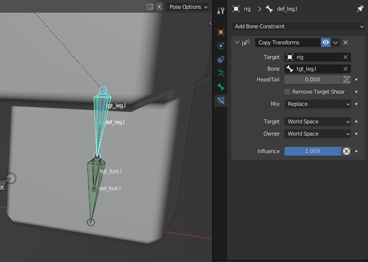

# 3D Rigging Overview

## Questions
- What are our control standards?
- Naming conventions?
- Visual communication?

## Deformation Bones
The skeleton of bones that deform the skin mesh.

## Target Bones
Target bones are a part of the control rig?
- Detach but keep parent.
- Select target bone then deformation bone.
- Assign the Constraint: **`Ctrl`** + **`Shift`** + **`C`** > **`Copy Transforms`**

## Control Bones
Bones used to control the rig.

Edit Mode parenting vs. Pose Mode parenting

Parenting bones must be done is Edit Mode?
