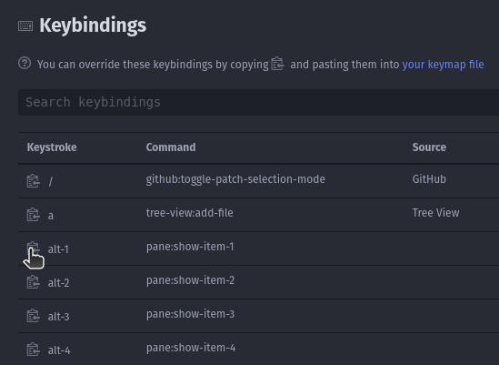
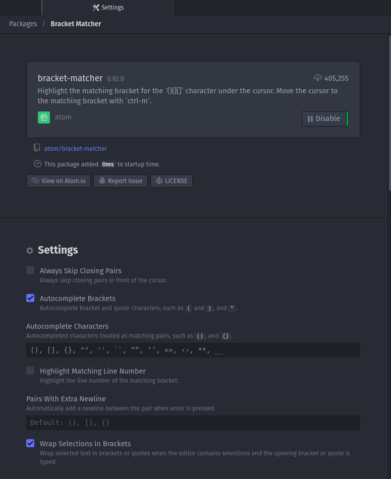

# Atom
How do we tame the most hackable open source text editor? We'll see soon enough!

## Sort
The items below still need to be sorted.

## keymap.cson
One can edit their key bindings by clicking `Edit` > `Preferences` > `Keybindings` > `your keymap file`.

- Linux location: ["~/.atom/keybindings.cson"](~/.atom/keybindings.cson)



> You can override these keybindings by copying _**(click the `copy` button)**_ and pasting them _**(`Ctrl` + `V`)**_ into [your keymap file](~/.atom/keybindings.cson)


```cson
'atom-workspace atom-text-editor:not([mini])':
  'ctrl-/': 'editor:toggle-line-comments'
```

## Addons
MD and GitHub.


## Editor settings
Setup for the Bracket Matcher package.


## Stylesheets
Clicking on `Edit` > `Stylesheet...`, we are able to edit the MD preview pane.
`Ctrl` + `Shift` + `M`

```css
.markdown-preview.markdown-preview
{
  /*Globals*/
  font-family: helvetica;
  color: #c9d1d9;
  background-color: #0d1117;

  /*Headings*/
  h1, h2, h3, h4, h5, h6 {color: #c9d1d9; padding-bottom: 0.3em; margin-top: 24px; margin-bottom: 16px; font-weight: 600; line-height: 1.25;}
  h1, h2 {border-bottom: 1px solid #21262d;}
  h1 {font-size: 2em;}
  h2 {font-size: 1.5em;}
  h3 {font-size: 1.25em;}
  h4 {font-size: 1em;}
  h5 {font-size: 0.875em;}
  h6 {font-size: 0.85em; color: #8b949e;}

  /*Body*/
  p, em, strong {color: #c9d1d9;}
  code {background-color: #343941; border-radius: 6px; padding: 0.2em 0.4em; color: inherit; font-size: inherit; font-weight: inherit;}

  hr {height: 0.25em; background-color: #30363d; border: none;}

  a {color: #58a6ff;}
  blockquote {border-left: 3px solid #30363d;}
  blockquote p, blockquote em, blockquote strong {color: #8b949e;}

  /*Tables*/
  tr:nth-child(odd) {background: #0d1117;}
  tr:nth-child(even) {background: #161b22;}

  th {border: 1px solid #30363d;}
  td {border: 1px solid #30363d;}

}
```
