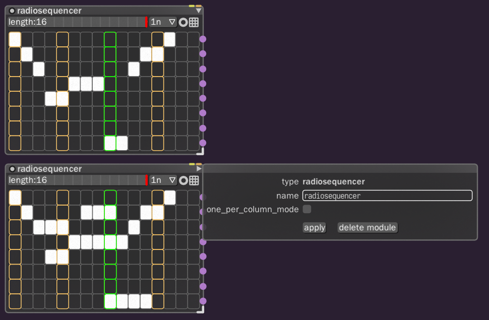
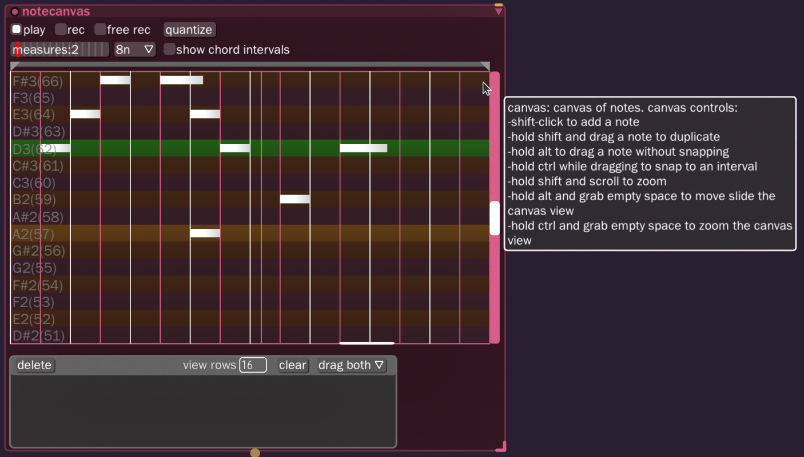

# Bespoke
As sound design n00bs, **we appreciate Bespoke more than is reasonably possible**. I've always found sound design tedious to get into, but Bespoke's node based structure, its wire animations, and how things are hooked together, have made it **so much easier to get started jamming**.

We love Bespoke and will be using it for production.
[Official website](https://www.bespokesynth.com/)

---

## Radio Sequencer _`radiosequencer`_
Perfect for playing the parts one wants, in chunks.

### Add to workspace
- Menu: **`other:`** > **`radiosequencer`**
- Quick hold: **`R`** > **`radiosequencer`**

### Flow Properties
- name: _(title the sequencer build)_
- one_per_column_mode: **`🞎`** _(unrestricted)_

[Official documentation](https://www.bespokesynth.com/docs/index.html#radiosequencer)

---

## Note Canvas _`notecanvas`_
A piano roll node. Hover over the note space to get the full control list.

### Spawning
- Menu: **`instrument:`** > **`notecanvas`**
- Quick hold: **`N`** > **`notecanvas`**

[Official documentation](https://www.bespokesynth.com/docs/index.html#notecanvas)

---

## Note Router _`noterouter`_

### Spawning
- Menu: **`note effects:`** > **`noterouter`**
- Quick hold: **`N`** > **`noterouter`**

### Preferences
- radiobuttonmode: **`🞎`**

[Official documentation](https://www.bespokesynth.com/docs/index.html#noterouter)

---

## Praise for Bespoke

### Top 5
There are so many awesome things about Bespoke that we could gush for hours, but for time we'll just limit the following list to our top 5 favorite features:
1. The animated wires and other graphics really makes one "feel" the audio through node visuals.
1. Quick hold the first letter of the node's name and select it from the menu list! Awesome!
1. Hover over a node parameter + `MMW` scroll to adjust the parameter value.
1. The BG warble graphics.
1. Click the Bespoke logo to make to make a node movie loop! So cool.

### Gripes

Small frustrations build up over time that impede the production flow.

- [ ] Users are able to clicking thru some UI areas into a background node parameters. The following UI become unclickable **if a node parameter field is behind** the top toolbar buttons:
- [ ] `toolbar` > `save`
- [ ] `toolbar` > `settings`
- [ ] `toolbar` > `node` selection buttons.
- [ ] Test: Move a notecanvas node up and behind the
- [ ] Can we add the `Backspace` functionality to the `Delete` key?
- [ ] Hotkey binding UI.
- [ ] When wishing to select multiple nodes at once, other node based apps allow `Shift` + `LMB` click a node to add the clicked node to the selection group.
- [ ] `Shift` + `LMB` click, or drag select nodes will add new selections to the group
- [ ] `Shift` + `LMB` click an already selected node to subtract the node from the selection group.
- [ ] Resizable nodes should be able to be resized from any edge or corner, instead of just the bottom right corner.
- [ ] When dragging a node, or wire connector, near the edge of the screen, the viewport should scroll like RTS games.
- [ ] Wires are drawn on top of node parameters making the parameters hard to see. Presumably the wires are drawn on top because the signals are more important than the nodes.
- [ ] Currently, unhooking a pin connector from a node requires a secret handshake: `LMB` drag the pin + `Backspace`. Suggestion: When the user drags the pin connector off the the node Have a constant screen pixel distance
- [ ] Inconsistent navigation button combos.
- [ ] `MMW` scroll won't affect the values of the `effectchain` > `basiceq` > eq column values.

### Wishlist
- [ ] Make everything nodes! Then allow the user to anchor any node to the workspace or screen space!
- [ ] Convert the top toolbar into individual nodes instead:
  - [ ] Bespoke logo.
  - [ ] Save, Load, Write audio.
  - [ ] Menu.
- [ ] `LMB` + drag on any non-parameter "blank" space on a node should move the node just like dragging on the node's title bar.
- [ ] Wire re-router pins. A type of node that allows us to move the wires to specific locations.
- [ ] Undo? :smile:
