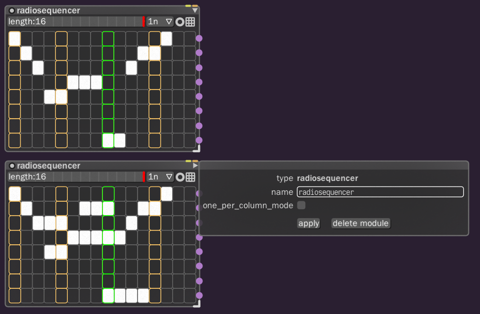
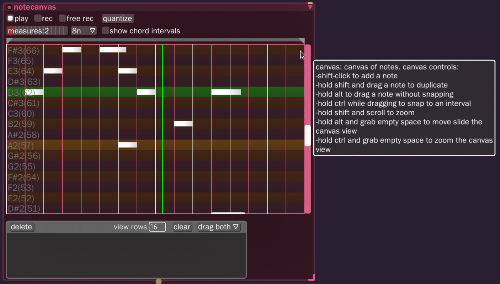

# Bespoke
##  All the best nodes.

### Radio Sequencer _(radiosequencer)_
Perfect for playing the parts one wants, in chunks.
[Official documentation](https://www.bespokesynth.com/docs/index.html#radiosequencer)

#### Spawning
- Menu: **`other:`** > **`radiosequencer`**
- Quick hold + click: **`R`** > **`radiosequencer`**

#### Properties
- name: _(title the sequencer build)_
- one_per_column_mode: **`🞎`** _(unrestricted)_

### Note Canvas _(notecanvas)_
A piano roll node.
[Official documentation](https://www.bespokesynth.com/docs/index.html#notecanvas)

#### Spawning
- Menu: **`instrument:`** > **`notecanvas`**
- Quick hold + click: **`N`** > **`notecanvas`**

### Note Router (noterouter)
[Official documentation](https://www.bespokesynth.com/docs/index.html#noterouter)

#### Spawning
- Menu: **`note effects:`** > **`noterouter`**
- Quick hold + click: **`N`** > **`noterouter`**

#### Preferences
- radiobuttonmode: **`🞎`**
