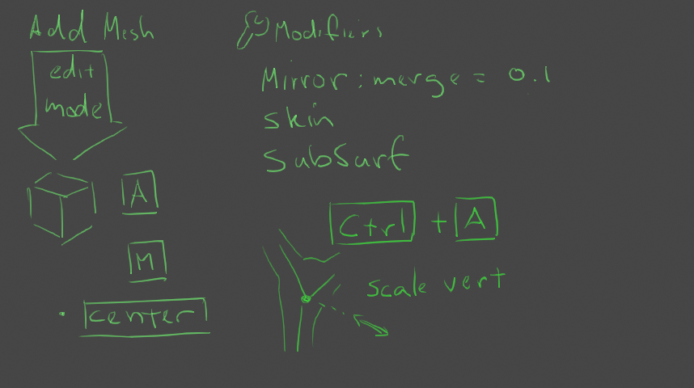
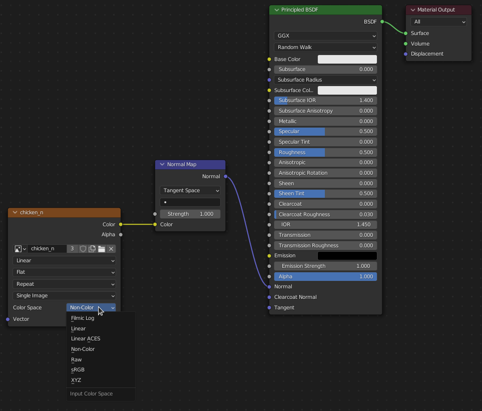
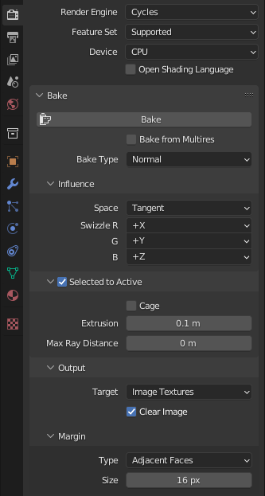

# 3D Modeling Overview

## Questions
- How far can we push Blender?
- Can we reasonably model, sculpt, and paint all in one yet?

## What should our open source modeling workflow be?
Different workflow types:

- **Box Model:** Model > UV > Texture.
- **Hi Poly Sculpts:** Vert Model + Skin Modifier > Sculpt. (color paint?)
- **Lo Poly Retopo:** Snap Model > UV > Texture Bake > Texture Paint.
- **Materials & Texturing:** Stitch > Touch Up > Export > ORM.

## 3D Deliverables
Provided with an asset's "README.md" description and image references modelers be prepared to deliver several models in several ways.
- Static Model: an unwrapped mesh and associated textures.
- Armature Model: a skeletal bone rigged and weight-painted mesh.
- Material & Textures: painted textures plugged into our (TBD) shaders.

When modeling a new game object (body, vessel, habitat), we start by gathering reference. What makes this thing believable in the world we wish to build?

## Blender
Blender is an awesome open source _([GPL](https://www.blender.org/about/license/))_ application that has been making steady inroads to becoming a standard tool for the game and animation industries. It will be our primary 3D modeling and animation tool.
- **Download Blender - https://blender.org/download**

### Scene Organization
_(TBD)_

### Box Model
#### Modifiers

- **`Mirror`**
- **`Smooth`**

#### Hotkeys
**`Edit Mode`**

- Vertex select: `1`
- Edge select: `2`
- Face select: `3`
- Extrude: `E`
- Loop Cut: `Ctrl` + `R`

### Vert Model

#### Modifiers

**`Mirror`**
- On Cage: `🗹`
- Clipping: `🗹`
- Merge: `0.1 m`

**`Skin`**
- Smooth Shading: 🗹 (only visible in Object Mode)
- Mark "pelvis" vertex as root: [Mark Root]

**`Subdivision Surface`**
- Levels Viewport: `2`

#### Hotkeys
**`Edit Mode > Vertex Selection`**
- Scale vertex radius: `Ctrl` + `A`

### Hi Poly Sculpt
#### Hotkeys
**`Sculpt Mode`**

- Brush Size: `F`
- Brush Strength: `Shift` + `F`
- Build out: `LMB` drag.
- Push in: `Ctrl` + `LMB` drag.
- Smooth: `Shift` + `LMB` drag.

### Lo Poly Retopo
#### Modifiers
**`Mirror`**
- Clipping: 🗹 (as needed)

**`Shrink Wrap`**
- Target: Sculpt Object

#### Hotkeys
**`Edit Mode` > `Vertex Selection`** _(or **`Edit Mode` > `Edge Selection`**)_
- Extrude: `E`
- Extrude to cursor: `Ctrl` + `RMB`

### Materials & Textures
Making it believable. _(TBD) depending on the export tools_

#### Hotkeys
**`Shading` > `Shader Editor`**
- Add Node: `Shift` + `A`

Don't forget to set the normal map node's Color Space: `Non-Color`

### Baking
It is common to **"bake"** _color_, _lighting_, _normal_, and object data from one mesh to another's texture maps.

#### Normal Map
**`Render Properties`**
- Render Engine: `Cycles`
  - `Bake`
    - Bake Type: `Normal`
  - Selected to Active: `🗹`

#### AO _(Ambient Occlusion)_
- [ ] Issue: Hi to Lo AO Bug:

Can't seem to grab the AO data from just the Sculpt. It keeps rendering the intersection of the Lo Poly and Hi Poly models.

### Helpful Add-ons
- https://github.com/nutti/Screencast-Keys/releases
