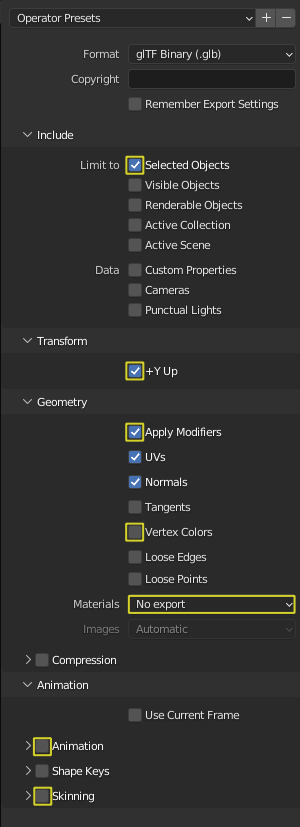
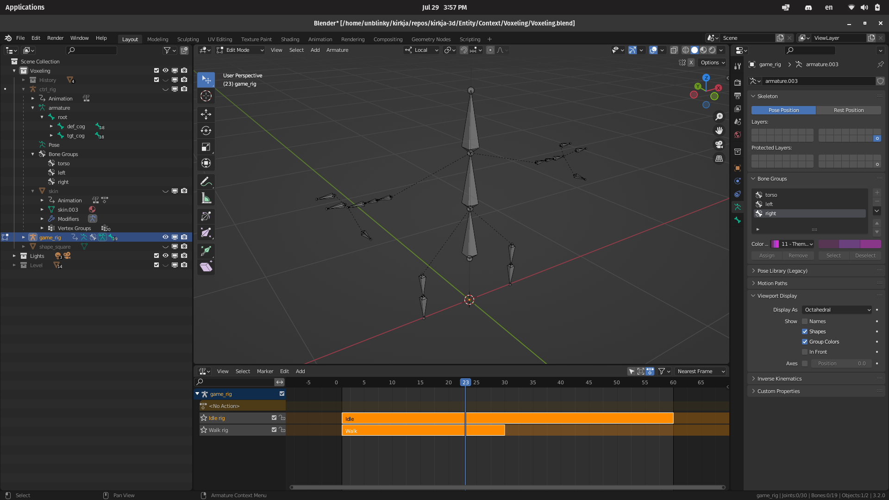
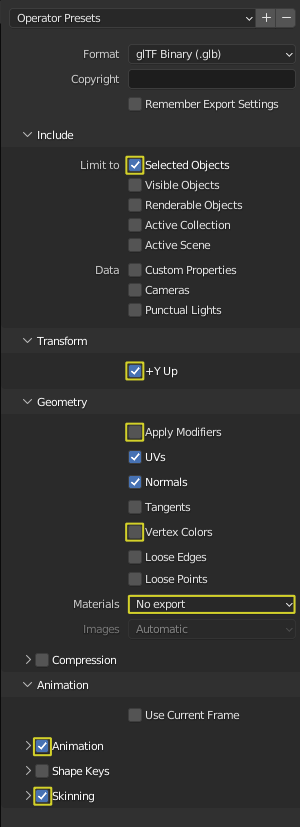

# Exporting Overview
Exporting is always more complicated than it initially seems. It will be even easier when we get a proper exporter script going.

## Exporting from Blender to Godot

### Basic Exporting
`File` > `Export` > `glTF 2.0 (.glb/.gltf)`
- Selected Objects: `🗹`
- +Y Up: `🗹`
- Apply Modifiers: `🗹`
- Vertex Colors: `◻`
- Materials: `No Export`
- Animation: `◻`
- Skinning: `◻`

### Rigs

#### Strip Armature
- Bake all control animation into the deformation bones.
- Remove all constraints.

#### NLA
Push down.

#### Export
Once the model is prepped:
- Select **Armature** and the weight painted **Skin**.

`File` > `Export` > `glTF 2.0 (.glb/.gltf)`
- Selected Objects: `🗹`
- +Y Up: `🗹`
- Apply Modifiers: `◻`
- Vertex Colors: `◻`
- Materials: `No Export`
- Animation: `🗹`
- Skinning: `🗹`

### Materials
Needs testing.
