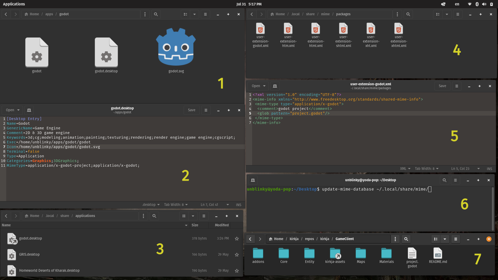

# Linux OS

Terminal
Select text then MMB to paste.

## How to register new mimetypes. (like "project.godot" files)


1. Find the locations of the app and the icon.
1. Edit the **"godot.desktop"** file to the absolute file path of the app:

```
[Desktop Entry]
Name=Godot
GenericName=Game Engine
Comment=2D & 3D game engine
Keywords=3d;cg;modeling;animation;painting;texturing;rendering;render engine;game engine;cgscript;
Exec=/home/unblinky/apps/godot/godot
Icon=/home/unblinky/apps/godot/godot.svg
Terminal=false
Type=Application
Categories=Graphics;3DGraphics;
MimeType=application/x-godot-project;application/x-godot;
```
3. Create a **symlink** to "godot.desktop" in **"~/.local/share/applications"**.
1. Create an XML file called "user-extension-godot.xml" in **"~/.local/share/mime/"**.
1. Edit the contents of **"user-extention-godot.xml"**:

```xml
<?xml version="1.0" encoding="UTF-8"?>
<mime-info xmlns="http://www.freedesktop.org/standards/shared-mime-info">
 <mime-type type="application/x-godot">
  <comment>godot project</comment>
  <glob pattern="project.godot"/>
 </mime-type>
</mime-info>
```
6. Open the Terminal and refresh the OS mime database: **`$ update-mime-database ~/.local/share/mime`**
1. Test it out by double clicking a "project.godot" file.
